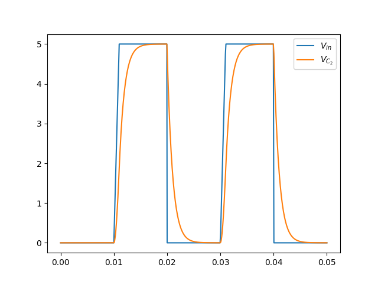

# pyspice-notebook

Minimal notebook showing a workflow using PySpice with Jupyter and Matplotlib.

## Install Dependencies

    pipenv install

## Run the notebook

    pipenv run jupyter notebook

## Example output

